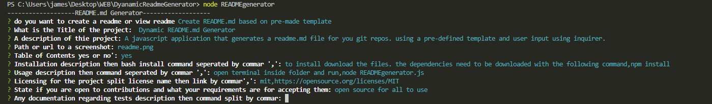

# Dynamic Readme.md Generator
A command line javascript script that asks the user for information regarding their project/repo and then formats that data into a readme.md file, that the user can then move into the repo


## Table of Contents
[Installation](#Installation)
[Usage](#Usage)
[licensing](#licensing)
[contributing](#contributing)
[tests](#tests)
[questions](#questions)
## Installation
, to install the project you can download the files from github. then open a terminal session inside the folder path and run
,
```bash  
npm install
``` 
## Usage
,
after installation which will download dependencies run
,
```bash  
node readmegenerator.js
``` 


https://user-images.githubusercontent.com/46641259/168408110-9847ae3e-d275-4aa4-82bc-b022b044db22.mp4


## Licensing
,(MIT),[https://opensource.org/licenses/MIT]

## Contributing
free to use and modify
## Tests
,n/a

## Questions
,jamesthomasbester@gmail.com
